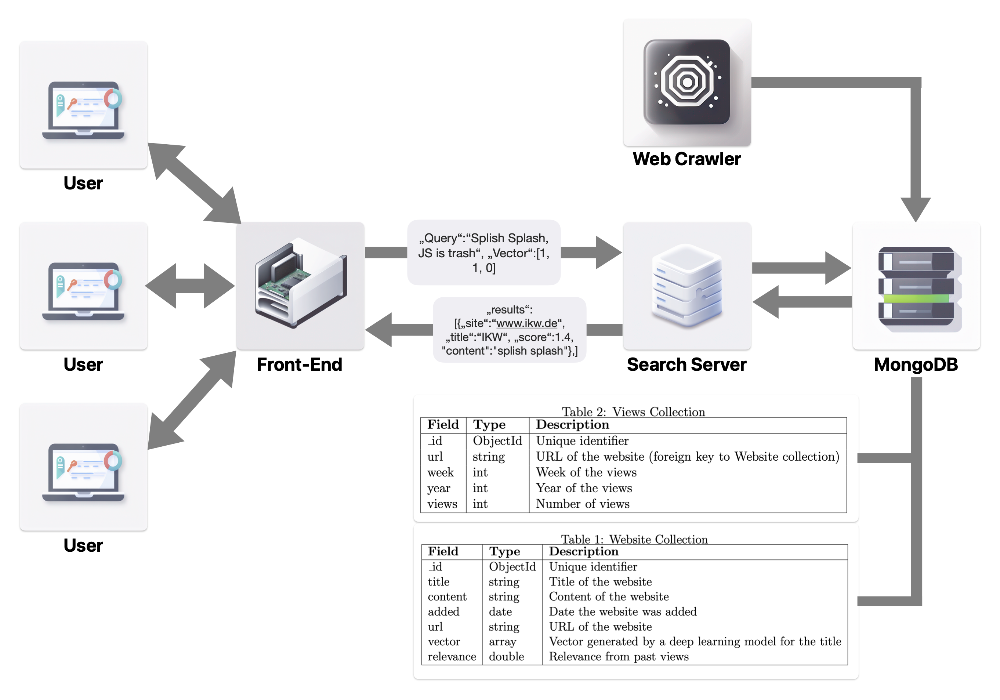

# Single-server crawler

## Project for AI and the Web
This is a simple web crawler that retrieves H1-headings and content from all directly or indirectly linked HTML-pages on the same server starting from a single URL.
This project was part of the course "AI and the Web" at _University of Osnabrueck_.
<p align="right">(<a href="#top">back to top</a>)</p>

## 📖 Table of Contents
- [Single-server crawler](#single-server-crawler)
  - [Project for AI and the Web](#project-for-ai-and-the-web)
  - [📖 Table of Contents](#-table-of-contents)
  - [❓ Why?](#-why)
  - [✨ Features of the crawler](#-features-of-the-crawler)
  - [💻 Usage](#-usage)
  - [💾 Structure](#-structure)
  - [🚫 Limitations](#-limitations)
  - [📝 Authors](#-authors)
  - [📎 License](#-license)

## ❓ Why?
To distribute the load of handeling user requests and doing the actual rankings of websites, we decided to split the search process in different application. On the one hand, there is the server that handles incoming requests and calculates the vectors. On the other hand, there is the application which loads the existing website data from a MongoDB database and matches the entries in this database with the user query, to return optimal results. Lastly there is the web crawler implemented in this repo that updates the search index database.
<br/> 
<p align="center">
 
</p>
<br/> 
<p align="right">(<a href="#top">back to top</a>)</p>

## ✨ Features of the crawler
From a single URL the crawler can extract both headers and all linked URLs on an HTML page and evaluate the linked URLs for validity, response type (only HTML responses are crawled), the domain (all links to different servers are ignored) and whether the URL has been visited and whether it needs to be added to the backlog for crawling. The headers from the webpages are then embedded using the multi-language DistilBERT model to compare the semantic similarity of search requests and the headers.
<p align="right">(<a href="#top">back to top</a>)</p>

## 💻 Usage

1. Clone the repository or download the code.

```bash
git clone https://github.com/AI-and-the-Web-UOS/crawler/
cd crawler
```

2. Install the required Python packages.

```bash
pip install -r requirements.txt
```
Or create a conda environment with the required packages.

```bash
conda  env create -n crawler -f crawler.yaml
conda activate crawler 
```

3. Set up your MongoDB server and replace the connection details in the code with your own.

4. Start the crawler.

```bash
python crawler.py
```
<p align="right">(<a href="#top">back to top</a>)</p>

## 💾 Structure
<!-- Project Structure -->

    .
    │── graphics
    │     └── SearchEngine.png
    │── README.md
    │── requirements.txt
    │── crawler.yaml                # yaml for creating conda env
    └── crawler.py                  # The file containing the crawler
<p align="right">(<a href="#top">back to top</a>)</p>

## 🚫 Limitations
Efficiently managing server loads is a critical aspect of web service optimization. One approach to achieve better load management is to assign specific clusters of websites to individual servers. By leveraging unsupervised clustering techniques on the vector representations of websites stored in the database, we can group similar websites together. Each server would then be responsible for serving requests related to websites within its designated cluster. This strategy ensures that servers are specialized in handling a specific subset of websites, minimizing the risk of overloading and optimizing resource utilization. Additionally, it enhances response times for users as they are directed to servers tailored to their search context. Such an approach not only improves server load management but also enhances the overall performance and scalability of the web service. But due to the scope of the project, this feature was not implemented.

The crawler is limited to same-server webpages and HTML-content.
<p align="right">(<a href="#top">back to top</a>)</p>

## 📝 Authors
[Christine Arnoldt](mailto:carnoldt@uni-osnabrueck.de) (main maintainer of the repo)<br/>
[Jonah Schlie](mailto:jschlie@uni-osnabrueck.de)<br/>
[Cornelius Wolff](mailto:cowolff@uos.de)<br/>

<p align="right">(<a href="#top">back to top</a>)</p>

## 📎 License
Copyright 2022 Christine Arnoldt, Jonah Schlie, Cornelius Wolff

Licensed under the Apache License, Version 2.0 (the "License");
you may not use this file except in compliance with the License.
You may obtain a copy of the License at

    http://www.apache.org/licenses/LICENSE-2.0

Unless required by applicable law or agreed to in writing, software
distributed under the License is distributed on an "AS IS" BASIS,
WITHOUT WARRANTIES OR CONDITIONS OF ANY KIND, either express or implied.
See the License for the specific language governing permissions and
limitations under the License.
<p align="right">(<a href="#top">back to top</a>)</p>
